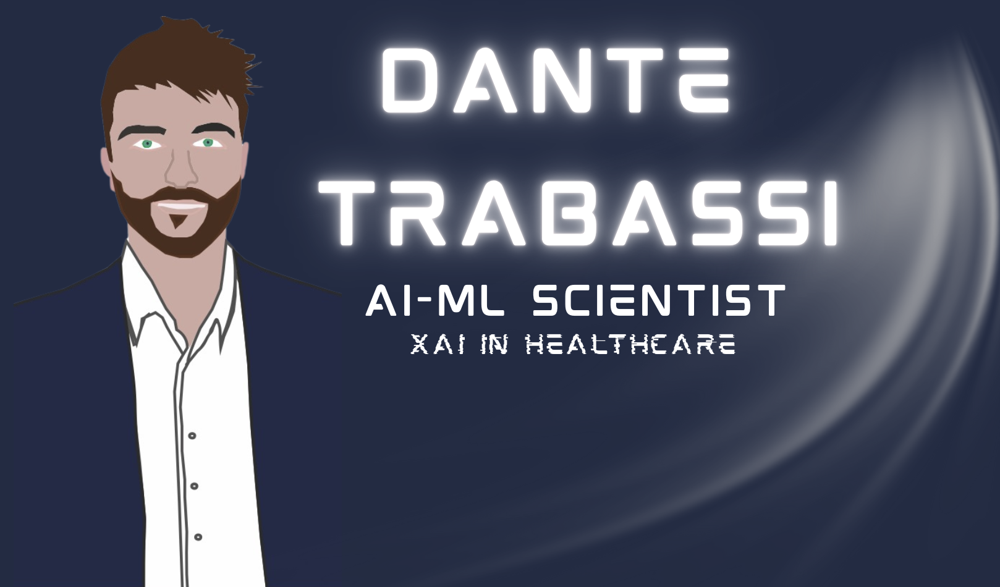

  

# Website (DanteTrb.github.io)

This repository powers my personal academic & AI portfolio website, showcasing research in clinical machine learning, explainable AI, and movement analysis.

🔗 [Visit the live site → dantetrb.github.io](https://dantetrb.github.io)

---

## 📌 What's inside?

This GitHub Pages site is a showcase of my work in:
- 🧬 Explainable AI for Clinical Movement Analysis
- 🧠 Gait & EMG modeling in Parkinson's Disease and Rare Neurological Disorders
- 🎯 Deployment of AI tools using Streamlit, Django, and Vercel
- 🧪 Generative AI (ctGAN), SHAP & SHAPSet interpretability

---

## 📁 Key Sections

- **Projects**: Webapps and models for fall risk, prodromal Parkinson, GAN-based phenotype detection  
- **Publications**: Peer-reviewed articles in *Sensors* and other journals  
- **CV**: Downloadable PDF  
- **GitHub QR**: Scan-and-go access to my full GitHub activity

---

---

> *Turning data into clinical insight, one step at a time.*  
> – Dante Trabassi, PhD Neuroscience @ Sapienza, AI-ML Scientist
